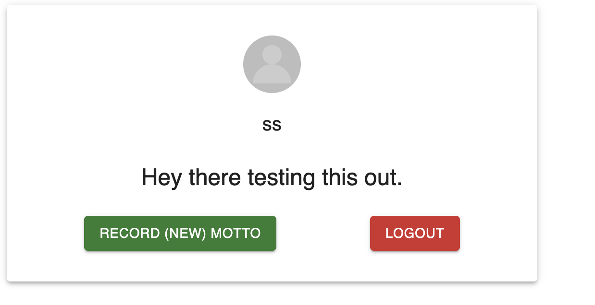
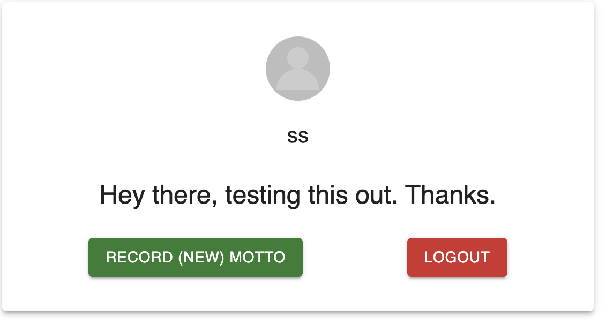

# Project Notes

## Overview

This document outlines the approach and key functionalities implemented in the project. It covers authentication token management, error handling, logout functionality, API service integration, and audio transcription using MediaRecorder API and openAI library.

## Approach

### Authentication Token Management

1. **Backend Token Generation**: Identified token creation at `/login` API.
   
2. **Frontend Token Handling**: Stored token in `localStorage` for global access. Future enhancement could involve global state management (e.g., Redux).

### Error Handling

- Implemented alerts for registration errors to improve user feedback.

### Logout Functionality

- Implemented token reset and redirection to main page on logout.

### API Service Integration

- Refactored `APIService.ts` to ensure `app-version` header sent with each request.
- Updated all network requests to use `APIService.request()` method for consistency.

### Audio Transcription

- Utilized MediaRecorder API on frontend for audio recording.
- Integrated openAI library on backend for accurate audio-to-text transcription.

## Resources

- **StackOverflow**: Used for troubleshooting and solutions.
- **Material-UI (MUI)**: UI framework for frontend components. Installation command: `npm install @mui/material @emotion/react @emotion/styled @mui/icons-material`.

## Implementation Status

All planned functionalities have been successfully implemented.

## Future Improvements

- Implement comprehensive state management (e.g., Redux) for better scalability.
- Enhance UI/UX with additional features and optimizations.

---

*Figure 1: A motto that will be replaced after recoding*

*Figure 2: Recorded audio replace with motto*
